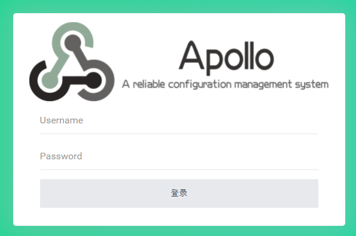

# 2021/10/31 Apollo配罝中心

[TOC]

<!-- toc -->

## 一、簡介

Apollo是中國携程框架研發部所開發的開源項目，實現分布式的配管理中心，本文章是基於官方文檔整理的布署筆記，細節可以查看[官網](https://github.com/apolloconfig/apollo)

## 二、架構圖


說明：

Apolloe 是由Portal、Admin、Config 三個模塊組成，Portal主要是管理後台，再通過不同的配罝，訪問不同環境的配罝中心，若實際應用上有需要DEV、UAT、PRO三個環境，則會需要三套Admin+Config

## 三、布署

### 1. 環境

| URL                       | 說明              |
| ------------------------- | ----------------- |
| http://192.168.1.17:8070  | Apollo-Portal     |
| http://192.168.1.17:18080 | Apollo-Admin-Dev  |
| http://192.168.1.17:18090 | Apollo-Config-Dev |
| http://192.168.1.17:28080 | Apollo-Admin-Uat  |
| http://192.168.1.17:28090 | Apollo-Config-Uat |
| http://192.168.1.17:38080 | Apollo-Admin-Pro  |
| http://192.168.1.17:38090 | Apollo-Config-Pro |

注：192.168.1.17 為測試機IP

### 2. docker-compose.yml

```yaml
version: '3'

services:
  # Portal
  apollo-portal:
    container_name: apollo-portal
    image: 'apolloconfig/apollo-portal:1.9.1'
    user: root
    restart: always
    # 環境變量中設罝不同環境的URL地址
    environment:
      - 'SPRING_DATASOURCE_URL=jdbc:mysql://apollo-db:3306/ApolloPortalDB?characterEncoding=utf8'
      - 'SPRING_DATASOURCE_USERNAME=root'
      - 'SPRING_DATASOURCE_PASSWORD=P@ssw0rd'
      - 'APOLLO_PORTAL_ENVS=dev,uat,pro'
      - 'DEV_META=http://apollo-config-dev:8080'
      - 'UAT_META=http://apollo-config-uat:8080'
      - 'PRO_META=http://apollo-config-pro:8080'
    ports:
      - '8070:8070'
    volumes:
      - '/opt/apollo/apollo-portal:/opt/logs'
    depends_on:
      - 'apollo-db'
  
  # 數據庫
  apollo-db:
    container_name: apollo-db
    image: 'percona:8.0'
    user: root
    restart: always
    command: 'mysqld --user=root'
    environment:
      - 'MYSQL_DATABASE=db'
      - 'MYSQL_ROOT_PASSWORD=P@ssw0rd'
    ports:
      - '3306:3306'
    volumes:
      - '/opt/apollo/apollo-db:/var/lib/mysql'  
  
  # DEV 環境
  apollo-admin-dev:
    container_name: apollo-admin-dev
    image: 'apolloconfig/apollo-adminservice:1.9.1'
    user: root
    restart: always
    # 不同環境需要不同數據庫
    environment:
      - 'SPRING_DATASOURCE_URL=jdbc:mysql://apollo-db:3306/ApolloConfigDevDB?characterEncoding=utf8'
      - 'SPRING_DATASOURCE_USERNAME=root'
      - 'SPRING_DATASOURCE_PASSWORD=P@ssw0rd'
    ports:
      - '18090:8090'
    volumes:
      - '/opt/apollo/apollo-admin-dev:/opt/logs'
    depends_on:
      - 'apollo-db'
      
  apollo-config-dev:
    container_name: apollo-config-dev
    image: 'apolloconfig/apollo-configservice:1.9.1'
    user: root
    restart: always
    # 不同環境需要不同數據庫
    environment:
      - 'SPRING_DATASOURCE_URL=jdbc:mysql://apollo-db:3306/ApolloConfigDevDB?characterEncoding=utf8'
      - 'SPRING_DATASOURCE_USERNAME=root'
      - 'SPRING_DATASOURCE_PASSWORD=P@ssw0rd'
    ports:
      - '18080:8080'
    volumes:
      - '/opt/apollo/apollo-config-dev:/opt/logs'
    depends_on:
      - 'apollo-db'

  # UAT 環境
  apollo-admin-uat:
    container_name: apollo-admin-uat
    image: 'apolloconfig/apollo-adminservice:1.9.1'
    user: root
    restart: always
    # 不同環境需要不同數據庫
    environment:
      - 'SPRING_DATASOURCE_URL=jdbc:mysql://apollo-db:3306/ApolloConfigUatDB?characterEncoding=utf8'
      - 'SPRING_DATASOURCE_USERNAME=root'
      - 'SPRING_DATASOURCE_PASSWORD=P@ssw0rd'
    ports:
      - '28090:8090'
    volumes:
      - '/opt/apollo/apollo-admin-uat:/opt/logs'
    depends_on:
      - 'apollo-db'
      
  apollo-config-uat:
    container_name: apollo-config-uat
    image: 'apolloconfig/apollo-configservice:1.9.1'
    user: root
    restart: always
    # 不同環境需要不同數據庫
    environment:
      - 'SPRING_DATASOURCE_URL=jdbc:mysql://apollo-db:3306/ApolloConfigUatDB?characterEncoding=utf8'
      - 'SPRING_DATASOURCE_USERNAME=root'
      - 'SPRING_DATASOURCE_PASSWORD=P@ssw0rd'
    ports:
      - '28080:8080'
    volumes:
      - '/opt/apollo/apollo-config-uat:/opt/logs'
    depends_on:
      - 'apollo-db'

  # PRO 環境
  apollo-admin-pro:
    container_name: apollo-admin-pro
    image: 'apolloconfig/apollo-adminservice:1.9.1'
    user: root
    restart: always
    # 不同環境需要不同數據庫
    environment:
      - 'SPRING_DATASOURCE_URL=jdbc:mysql://apollo-db:3306/ApolloConfigProDB?characterEncoding=utf8'
      - 'SPRING_DATASOURCE_USERNAME=root'
      - 'SPRING_DATASOURCE_PASSWORD=P@ssw0rd'
    ports:
      - '38090:8090'
    volumes:
      - '/opt/apollo/apollo-admin-pro:/opt/logs'
    depends_on:
      - 'apollo-db'
      
  apollo-config-pro:
    container_name: apollo-config-pro
    image: 'apolloconfig/apollo-configservice:1.9.1'
    user: root
    restart: always
    # 不同環境需要不同數據庫
    environment:
      - 'SPRING_DATASOURCE_URL=jdbc:mysql://apollo-db:3306/ApolloConfigProDB?characterEncoding=utf8'
      - 'SPRING_DATASOURCE_USERNAME=root'
      - 'SPRING_DATASOURCE_PASSWORD=P@ssw0rd'
    ports:
      - '38080:8080'
    volumes:
      - '/opt/apollo/apollo-config-pro:/opt/logs'
    depends_on:
      - 'apollo-db'
```

### 3.執行 & 導入數據

啟動 docker-compose

```shell
>> docker-compose up -d
```

由於是使用MySQL8，密碼認證需要更改

注：請自行加固密碼安全

```shell
>> docker exec -it apollo-db mysql -uroot -pP@ssw0rd -e "ALTER USER 'root'@'%' IDENTIFIED WITH mysql_native_password BY 'P@ssw0rd';"
```

創建數據庫

```shell
>> mysql -h 192.168.1.17 -u root -pP@ssw0rd -e 'CREATE DATABASE ApolloPortalDB DEFAULT CHARACTER SET utf8 COLLATE utf8_general_ci;'
>> mysql -h 192.168.1.17 -u root -pP@ssw0rd -e 'CREATE DATABASE ApolloConfigDevDB DEFAULT CHARACTER SET utf8 COLLATE utf8_general_ci;'
>> mysql -h 192.168.1.17 -u root -pP@ssw0rd -e 'CREATE DATABASE ApolloConfigUatDB DEFAULT CHARACTER SET utf8 COLLATE utf8_general_ci;'
>> mysql -h 192.168.1.17 -u root -pP@ssw0rd -e 'CREATE DATABASE ApolloConfigProDB DEFAULT CHARACTER SET utf8 COLLATE utf8_general_ci;'
```

導入數據

```shell
>> wget https://raw.githubusercontent.com/apolloconfig/apollo-build-scripts/master/sql/apolloconfigdb.sql
>> wget https://raw.githubusercontent.com/apolloconfig/apollo-build-scripts/master/sql/apolloportaldb.sql
# 需要修改 apolloconfigdb.sql，移除創建數據庫SQL

>> mysql -h 192.168.1.17 -u root -pP@ssw0rd ApolloPortalDB < apolloportaldb.sql 
>> mysql -h 192.168.1.17 -u root -pP@ssw0rd ApolloConfigDevDB < apolloconfigdb.sql
>> mysql -h 192.168.1.17 -u root -pP@ssw0rd ApolloConfigUatDB < apolloconfigdb.sql 
>> mysql -h 192.168.1.17 -u root -pP@ssw0rd ApolloConfigProDB < apolloconfigdb.sql 
```

修改各環境admin讀取config服務的URL

```shell
>> mysql -h 192.168.1.17 -u root -p 
>> UPDATE ApolloConfigDevDB.ServerConfig SET `value`='http://apollo-config-dev:8080/eureka/' WHERE `key`='eureka.service.url';
>> UPDATE ApolloConfigUatDB.ServerConfig SET `value`='http://apollo-config-uat:8080/eureka/' WHERE `key`='eureka.service.url';
>> UPDATE ApolloConfigProDB.ServerConfig SET `value`='http://apollo-config-pro:8080/eureka/' WHERE `key`='eureka.service.url';
```

## 四、測試

可以訪問個環境的Admin頁面，確認服務是否正常啟用，如 192.168.1.17:18080


訪問 Portal 頁面(192.168.1.17:8070)，默認帳密 apollo/admin




測試配罝文件的抓取，不同URL代表不同環境，沒異常的話，就可以給程序正常調用

```shell
>> curl 'http://192.168.1.17:18080/configs/SampleApp/default/application'
{"appId":"SampleApp","cluster":"default","namespaceName":"application","configurations":{"timeout":"100"},"releaseKey":"20211101001334-1dc5a1de1881599c"}
>> curl 'http://192.168.1.17:28080/configs/SampleApp/default/application'
{"appId":"SampleApp","cluster":"default","namespaceName":"application","configurations":{"timeout":"100"},"releaseKey":"20211101001349-1dc5adf81c2a26a2"}
>> curl 'http://192.168.1.17:38080/configs/SampleApp/default/application'
{"appId":"SampleApp","cluster":"default","namespaceName":"application","configurations":{"timeout":"100"},"releaseKey":"20211101001400-1dc5a7eb1af82f79"}
```

